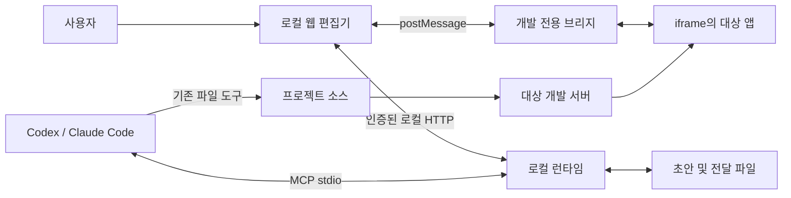

# Tweakloom 설계 문서

- 작성일: 2026-09-28
- 상태: 검토용 설계 초안. 구현 및 플러그인 설치 검증 전.
- 저장소: https://github.com/minyongP/tweakloom
- 라이선스: MIT
- 문서 범위: 제품 동작, 초기 지원 범위, 로컬 구조, 변경 데이터, AI 전달, 검증 기준

## 1. 만들려는 것

Tweakloom은 실행 중인 프론트엔드를 보면서 배치·모양·상호작용을 다듬고, 완성한 초안을 Codex 또는 Claude Code에 전달하는 로컬 시각 편집 도구다.

사용자는 화면에서 원하는 결과를 만든다. 편집기는 변경 이유와 수치, 대상, 전후 화면을 보관한다. AI는 이 명세를 읽어 실제 프로젝트 코드를 수정한다. 수정된 앱을 다시 실행해 사용자가 결과를 확인한다.

일반 편집 동작은 프로젝트 소스를 수정하지 않는다. 단, 최초 연결에는 개발 환경 전용 브리지 스크립트나 설정 추가가 필요하다. 이 연결 변경은 적용 전에 안내하며 배포 빌드에는 포함하지 않는다.

성공 기준은 “예쁜 화면을 만들었다”가 아니라 “사용자가 편집한 대상과 의도가 보존되어 AI가 실제 코드에 반영하고, 사용자가 그 결과를 확인할 수 있다”이다.

## 2. 요구사항과 설계상 기본값

### 사용자가 요청한 사항

- 오픈소스 플러그인으로 배포한다.
- Codex와 Claude에서 사용한다.
- AI가 만든 프론트를 즉시 확인한다.
- 웹에서 컴포넌트를 선택하고 모양과 설정을 조절한다.
- 만든 컴포넌트를 드래그 앤 드롭으로 배치한다.
- 상호작용도 웹에서 지정하고 확인한다.
- 편집을 마친 후 AI에게 실제 구현을 요청한다.
- Vue와 Next.js 같은 스택으로 확장할 수 있어야 한다.
- 별도 도메인이 필요 없는 구조로 만든다.

### 이 문서에서 제안하는 기본값

- 초기 연결 검증은 React + Vite의 단일 페이지 예제로 시작한다. Next.js와 Vue는 같은 흐름을 검증한 뒤 연결 범위를 넓힌다. 이는 사용자 확정 요구사항이 아니라 구현 위험을 줄이기 위한 순서다.
- 편집기 자체는 React + TypeScript, 로컬 프로세스는 Node.js로 작성한다. 대상 앱의 프레임워크와 편집기의 프레임워크는 독립적이다.
- Claude의 초기 대상은 로컬 파일과 MCP를 사용할 수 있는 Claude Code다. 일반 웹 채팅 및 Claude Desktop 지원은 별도 검증 대상이다.
- Codex도 로컬 MCP 프로세스를 사용할 수 있는 환경을 대상으로 한다. 각 앱 버전별 설치·권한 동작을 실제로 검증한 뒤 지원 표에 기록한다.
- 브라우저 편집기와 로컬 MCP를 공유하고, 플러그인 배포 설정만 호스트별로 나눈다.
- 서비스 회원가입, 자체 AI API 키, 클라우드 저장, 별도 도메인은 요구하지 않는다. 사용자가 이용하는 AI 도구의 계정·요금·권한은 그대로 적용된다.

## 3. 방식 비교와 선택

| 방식 | 장점 | 부담 | 결정 |
|---|---|---|---|
| 편집할 때마다 소스 변경 | 지원 동작을 정밀하게 코드에 반영 | 프레임워크·스타일 방식별 수정 엔진 필요 | 초기 범위에서 제외 |
| 화면 초안과 변경 명세를 AI에 전달 | 여러 스택으로 확장하기 쉽고 기존 AI 작업 흐름 활용 | AI 적용 후 검증 필요 | 채택 |
| 별도 캔버스에서 화면 전체 재작성 | 편집 상태를 완전히 통제 | 기존 앱 동작·스타일을 재현하기 어려움 | 초기 범위에서 제외 |

실제 앱을 미리보기로 사용하되 편집 변경은 임시 DOM과 별도 명세에 기록한다. 픽셀 좌표나 스크린샷만 전달하지 않는다.

## 4. 사용자 흐름

1. 프로젝트에서 개발 서버를 실행한다. 초기 버전은 임의의 시작 명령을 자동 실행하지 않는다.
2. AI에 Tweakloom 열기를 요청한다. 프로젝트 루트와 개발 서버 주소를 전달한다.
3. 연결 도구가 브리지 설정 여부를 확인하고 로컬 편집기 주소를 반환한다. 자동으로 브라우저를 열지 못하는 환경에서는 링크로 연다.
4. 편집기에 현재 앱을 띄운다. AI가 프로젝트를 수정하면 개발 서버의 갱신이 미리보기에 반영된다.
5. 사용자가 요소를 선택하고 모양·문구·배치·상호작용을 편집한다.
6. 변경 목록에서 각 대상, 적용 범위, 이전 값과 새 값을 확인한다.
7. ‘AI에 전달’로 특정 초안 리비전을 고정하고 변경 묶음과 요청문을 만든다.
8. 사용자가 기존 Codex·Claude Code 채팅에서 적용을 요청한다. AI가 MCP로 해당 묶음을 읽어 코드를 수정한다.
9. 초안 효과를 제거한 실제 앱 화면에서 적용 결과를 확인한다. AI가 작업 완료를 보고해도 사용자 확인 전에는 ‘검증 완료’로 표시하지 않는다.

‘AI에 전달’ 버튼이 실행 중인 채팅을 자동으로 깨우거나 프롬프트를 자동 제출한다고 가정하지 않는다. 초기 버전은 요청문 복사를 기본 경로로 삼는다. 호스트에 공식 전달 기능이 있고 실제 검증을 통과하면 추가한다.

## 5. 편집 화면

| 영역 | 내용 |
|---|---|
| 상단 | 연결 상태, 현재 경로, 화면 크기, 편집/실행 모드, 저장 상태, AI에 전달 |
| 왼쪽 | 현재 화면의 요소 트리, 등록된 컴포넌트 목록 |
| 중앙 | 실제 앱 미리보기, 선택 테두리, 삽입 위치 표시 |
| 오른쪽 | 문구·모양·레이아웃·상호작용 설정 |
| 변경 패널 | 변경 대상과 범위, 전후 값, 충돌, 되돌리기 |

편집 모드에서는 링크 이동·폼 제출 등 앱의 기본 클릭 동작을 차단하고 선택을 우선한다. 실행 모드는 앱 동작을 허용하므로 실제 개발 API를 호출할 수 있음을 표시한다. 초안 상호작용 시연은 실행 모드와 구별하고, 정의된 시연 동작만 실행한다.

색상 입력에는 색상 선택기, 숫자 조절에는 기본 입력 컨트롤을 우선 사용한다. 드래그에는 키보드 이동과 위/아래 이동 버튼을 함께 제공한다. 선택 상태와 오류는 색상만으로 구별하지 않는다.

## 6. 초기 기능 범위

### 6.1 선택과 모양 편집

- 현재 경로에서 단일 요소를 선택한다.
- 순수 텍스트 요소의 문구, 글자 크기·두께·색상, 배경, 테두리·반경, 여백, 너비·높이를 편집한다.
- 혼합된 자식 구조를 가진 요소의 문구를 바꾸기 위해 전체 innerHTML을 교체하지 않는다. 해당 텍스트 자식을 따로 선택한다.
- 간격 및 크기는 초기에는 px와 명시적인 auto를 지원한다. 퍼센트·계산식·전체 CSS 편집은 후속 범위다.
- 일반 CSS와 Tailwind 모두 계산된 스타일을 읽어 시각 초안을 만들 수 있다. 원래 스타일 소유 위치와 적절한 구현 방식은 AI가 확인한다.
- 한 화면 크기에서 만든 값을 모든 반응형 구간에 자동 적용하지 않는다. 적용 범위는 ‘현재 화면 조건’ 또는 ‘전체 화면 공통 의도’로 명시한다.

### 6.2 드래그 앤 드롭

- 초기에는 같은 부모 안에서 일반 흐름으로 배치된 형제 요소 순서 변경을 지원한다.
- 수동 grid-area, 절대 위치, 서로 다른 부모로 이동, 가상 목록 등은 지원 불가 사유를 표시한다.
- 드래그 결과는 좌표 대신 ‘대상 A를 대상 B 앞에 배치’처럼 의미 있는 명령으로 저장한다.
- DOM 재배치는 시각 초안이다. React나 Vue의 렌더링 상태를 변경했다고 간주하지 않는다.

### 6.3 컴포넌트 재사용

- 초기 등록 방식은 현재 화면에서 선택한 요소 묶음을 컴포넌트 목록에 저장하는 방식이다.
- 복제할 때 보이는 DOM과 계산된 스타일의 제한된 속성을 복사한다. script·이벤트 속성·중복 ID·민감한 폼 값을 제거하고 초안 전용 식별자를 부여한다.
- 컴포넌트 목록에서 허용된 컨테이너로 끌어와 시각 초안을 삽입할 수 있다.
- 복제된 DOM에는 원래 프레임워크 상태나 이벤트 핸들러가 따라오지 않는다. 이 항목은 ‘시각 복제’로 표시하며 필요한 동작은 별도로 지정한다.
- 실제 컴포넌트의 재사용·추출·props 연결은 AI에게 전달할 구현 의도에 포함한다. 프로젝트 전체에서 모든 컴포넌트를 자동 수집하는 기능은 후속 범위다.

### 6.4 상호작용

- 클릭 → 지정 요소 표시/숨김, 토글을 초기 시연 범위로 둔다.
- 호버 → 제한된 모양 변화 및 해제를 지원한다.
- 모달은 준비된 대상 요소를 표시/숨김하는 방식으로 시연한다. 실제 구현에는 포커스 이동·복귀, Escape 닫기 등 접근성 조건을 전달한다.
- API 호출, 인증, 결제, 데이터 저장은 시연하지 않는다. 필요 동작은 자연어 요구사항으로 기록하고 ‘구현 필요’로 표시한다.
- 상호작용은 trigger, target, action, 종료 조건을 저장한다. 문장만 저장해 AI가 동작을 추측하게 하지 않는다.

### 6.5 후속 범위

Figma식 무한 캔버스, 임의 부모 간 이동, 애니메이션 타임라인, 다중 선택, 다중 사용자 협업, 자동 배포, 전체 디자인 시스템 추출은 초기 버전에 포함하지 않는다.

## 7. 실행 구조



하나의 런타임이 MCP 도구, 로컬 HTTP, 편집기 정적 파일, 초안 저장을 맡는다. DB·메시지 큐·클라우드 서버는 도입하지 않는다. 기능은 src 아래의 editor, bridge, server, shared 디렉터리로 구분하며 처음부터 별도 패키지 여러 개로 나누지 않는다.

초기에는 런타임 인스턴스 하나가 프로젝트 하나를 맡는다. 다른 호스트가 같은 프로젝트를 열면 저장소 잠금을 확인해 두 번째 쓰기를 거절하고 기존 세션 안내를 제공한다. 종료한 프로세스의 잠금은 생존 여부와 프로젝트 식별자를 확인한 후 복구한다.

MCP는 stdio를 사용한다. stdout은 프로토콜 전용이며 로그는 stderr로 보낸다. 브라우저 통신은 별도의 로컬 HTTP를 사용한다. 편집기가 HTTP 서버를 임의 종료하지 않으며 명시적 세션 종료 또는 소유 MCP 연결 종료 시 저장 후 정리한다.

## 8. 대상 앱 연결과 동기화

### 8.1 브리지 연결

브리지는 대상 앱의 개발 페이지 안에서 실행돼 요소 선택, 경계 상자, 스타일 조회, 초안 적용을 처리한다. 부모 편집기와 개발 서버의 포트가 달라도 부모가 iframe DOM을 직접 읽지 않으며 검증된 postMessage로 통신한다.

첫 구현은 Vite 개발 설정에서 브리지를 주입한다. Next.js와 Vue에서도 동일한 브리지 메시지 계약을 사용하되 개발 전용 로딩 방식은 실제 환경에 맞게 추가한다. Next.js의 서버 컴포넌트 파일을 무조건 클라이언트 컴포넌트로 바꾸지 않는다.

iframe 차단 헤더나 CSP로 연결이 안 되면 원인을 표시한다. 임의 사이트를 프록시하거나 보안 헤더를 자동으로 제거하지 않는다. 사용자가 관리하는 개발 앱의 필요한 설정 변경을 구체적으로 안내한다.

### 8.2 화면 요소 식별

대상마다 현재 세션 ID와 경로, 프레임, 태그, role, 접근 가능한 이름, 명시적인 data 속성, 부모 관계, 짧은 텍스트 지문을 보관한다. CSS selector는 보조 단서다. nth-child 하나만으로 대상을 확정하지 않는다.

현재 DOM에서의 ID는 영구 식별자가 아니다. 새로고침 후에는 단서로 다시 찾고, 후보가 정확히 하나일 때만 연결한다. 반복 카드처럼 같은 후보가 여러 개면 사용자 재선택이 필요하다.

sourceHint는 선택 정보다. 신뢰할 수 있는 개발 메타데이터가 있을 때만 파일·위치를 첨부하고, 없으면 null로 둔다. 추측한 소스 경로를 사실처럼 기록하지 않는다.

반복 UI 변경은 ‘이 데이터 항목만’, ‘반복 항목 전체’, ‘이 컴포넌트가 쓰이는 곳 전체’ 중 의도를 요구한다. 이를 알아내지 못하면 전달 전 해결할 항목으로 남긴다.

### 8.3 리렌더링과 초안 복구

임시 DOM 변경은 프레임워크 리렌더링에서 사라지거나 충돌할 수 있다. 브리지는 자기 변경과 앱 변경을 구별하고, 앱 갱신을 발견하면 초안을 저장한 뒤 현재 적용을 중단한다. DOM을 계속 강제로 덮어써 프레임워크와 경쟁하지 않는다.

단순 스타일·문구 변경은 대상이 유일하게 재연결되고 이전 값 조건을 만족할 때만 다시 적용한다. 구조 변경 및 시각 복제 이후 앱 구조가 달라졌다면 새 미리보기를 로드하고 사용자 재확인을 요구한다.

연결 끊김·HMR·경로 이동이 있어도 초안 파일은 유지한다. 해결되지 않은 변경은 ‘연결 필요’로 표시한다. 충돌이 있는 묶음의 AI 전달은 막고 재선택 또는 해당 변경 제외를 안내한다.

## 9. 초안 데이터와 저장

저장 위치는 대상 프로젝트 아래 .tweakloom/이다. 로컬 설정과 캡처가 담기므로 Git 제외를 안내한다. 프로젝트 .gitignore 수정은 연결 설정 과정에서 알리고 적용한다.

```text
.tweakloom/
  session.json
  drafts/<draft-id>.json
  handoffs/<handoff-id>/
    manifest.json
    request.md
    assets/
```

작업 초안에는 schemaVersion, projectId, draftId, revision, route, viewport, 기준 정보, 대상 목록, 변경 목록, 변경 이력을 저장한다. 서버가 리비전을 증가시키며 편집 저장 요청의 expectedRevision이 다르면 덮어쓰지 않고 충돌을 반환한다.

JSON은 임시 파일 작성 후 교체해 저장하고 직전 정상본을 유지한다. 손상된 파일이 발견되면 원본을 보존하고 복구 선택지를 제공한다. 실행 취소·다시 실행은 초안 명령 이력에 적용한다. AI가 바꾼 소스를 자동으로 되돌리지 않는다.

아래는 하나의 전달 묶음 예시다. Git HEAD만으로 미커밋 변경을 판별할 수 없으므로 관련 소스 지문과 앱 갱신 세대를 함께 사용한다. sourceFiles가 비어 있으면 AI가 대상 파일을 찾은 후 쓰기 직전 지문을 확보해야 한다.

```json
{
  "schemaVersion": 1,
  "handoffId": "handoff-001",
  "draftId": "draft-001",
  "revision": 7,
  "projectId": "project-local-001",
  "route": "/products",
  "viewport": { "width": 1280, "height": 800 },
  "baseline": {
    "gitHead": null,
    "sourceFiles": [],
    "appGeneration": 3
  },
  "targets": [
    {
      "id": "target-buy",
      "locator": {
        "tag": "button",
        "role": "button",
        "accessibleName": "구매",
        "parentHint": "상품 상세 영역"
      },
      "sourceHint": null,
      "scope": "selected-instance"
    }
  ],
  "operations": [
    {
      "id": "op-001",
      "type": "set-style",
      "targetId": "target-buy",
      "property": "height",
      "before": "36px",
      "after": "44px",
      "responsiveScope": "current-viewport"
    }
  ],
  "assets": [],
  "acceptance": ["1280px 화면에서 구매 버튼 높이는 44px이다."],
  "status": "ready"
}
```

초기 operation 종류는 set-style, set-text, reorder, insert-visual-copy, set-interaction이다. 각 종류는 별도 허용 필드와 값 검증을 갖는다. 임의 JavaScript, HTML 문자열 실행, 임의 셸 명령은 명세에 허용하지 않는다.

reorder는 targetId·parentId·beforeTargetId를, insert-visual-copy는 등록 항목 ID·삽입 위치·새 초안 ID를 기록한다. set-interaction은 trigger·대상·허용 동작·해제 조건을 기록한다. 재생 순서는 명시적으로 보존한다.

전달 묶음은 고정된 리비전의 불변 스냅샷이다. 전달 후 추가 편집은 작업 초안의 새 리비전에 저장하며 이전 전달 내용은 바꾸지 않는다.

## 10. AI 전달 계약

MCP 도구 이름과 입출력은 제안이며 구현 시 스키마로 검증한다.

| 도구 | 입력 | 결과와 제한 |
|---|---|---|
| open_editor | projectRoot, previewUrl | 검증된 세션 ID와 편집기 URL. 임의 실행 명령을 받지 않음 |
| get_draft | sessionId, draftId | 현재 리비전·변경·충돌을 조회 |
| prepare_handoff | draftId, expectedRevision | 충돌 없는 리비전을 고정하고 handoffId·요청문 생성 |
| get_handoff | handoffId | 명세와 선택된 첨부 자료 조회 |
| report_result | handoffId, changedFiles, checks, outcome | AI의 구현 결과 기록. 사용자 검증 완료를 대리하지 않음 |

브라우저의 ‘AI에 전달’과 MCP prepare_handoff는 같은 서버 함수를 사용한다. 손으로 고른 초안 리비전을 AI가 다른 리비전으로 바꿔 읽지 않도록 요청문에 handoffId를 넣는다.

스킬은 AI에게 다음 순서를 안내한다.

1. 정확한 handoffId와 프로젝트를 확인한다.
2. 명세와 관련 코드를 읽고 대상·반복 범위·스타일 소유 위치를 확인한다.
3. 기준 이후 파일이 바뀌었는지 확인한다. 기존 사용자 변경을 보존하고 대상이 모호하면 질문한다.
4. 프로젝트의 기존 컴포넌트와 스타일 방식을 재사용해 필요한 변경만 구현한다.
5. 관련 빌드·검사와 화면 확인을 수행하고 결과를 기록한다.
6. 적용 실패, 일부 완료, 미검증 항목을 구별해 보고한다.

AI가 파일을 수정할 때 쓰는 권한과 도구는 호스트가 관리한다. Tweakloom은 코드 수정용 범용 쓰기 API를 별도로 제공하지 않는다. 파일 변경을 원자적으로 되돌릴 수 있다고 약속하지 않으며 실패 시 수정 파일과 검증 결과를 남긴다.

## 11. 결과 확인과 캡처

기본 검증은 초안 효과를 제거한 앱을 같은 경로·화면 크기·가능한 동일 데이터 상태로 다시 열어 비교하는 것이다. 전후 캡처는 참고 자료이며 동작·접근성 검사를 대신하지 않는다.

캡처를 위해 Playwright의 별도 브라우저 컨텍스트를 사용하는 방식을 제안한다. 개발 브리지로 초안을 재생하고 화면을 촬영하되 기존 사용자 브라우저 쿠키를 자동 추출하지 않는다. 별도 컨텍스트에서 로그인이 필요하거나 데이터 상태를 재현하지 못하면 캡처 불가 사유를 표시하고 사용자가 준비한 이미지를 첨부할 수 있게 한다.

전후 상태를 동일하게 재현할 수 없으면 자동 비교 성공으로 처리하지 않는다. 이미지 첨부 없이도 구조화 명세는 전달할 수 있으며, 그 경우 시각 증거가 없음을 AI에 알린다.

상태는 ready → applying → needs-review → verified로 이어진다. applying은 AI가 작업을 시작했다고 보고했을 때만 표시한다. 실패 시 failed 또는 partial, 기준 변경 시 stale로 표시한다. 사용자 확인만 verified로 전환한다.

## 12. 보안과 데이터 경계

- 로컬 HTTP는 127.0.0.1에만 바인딩하고 Host·Origin 및 세션 인증을 검증한다. LAN 공개는 초기 범위에 없다.
- 시작용 비밀은 일회용으로 교환해 세션을 만들고 URL에서 제거한다. 로그·전달 묶음에 인증 정보를 기록하지 않는다.
- postMessage는 정확한 origin과 event.source, 세션 식별자, 메시지 스키마를 확인한다. origin에 *를 사용하지 않는다.
- 사용자가 지정한 개발 서버의 정확한 주소와 포트만 연결한다. 임의 외부 주소·리다이렉트·파일 URL을 허용하지 않는다.
- 브리지는 요소 정보와 허용된 편집 명령만 처리한다. 대상 앱에 로컬 파일 읽기나 셸 실행 권한을 주지 않는다.
- 파일 경로는 프로젝트 루트 기준으로 정규화하고 심볼릭 링크를 포함한 실제 경로가 허용 범위를 벗어나면 거절한다.
- .env, 토큰, 비밀번호 필드, 쿠키, localStorage 전체를 수집하지 않는다. 화면에 표시된 정보와 캡처에는 민감한 내용이 있을 수 있으므로 전달 전 목록을 확인할 수 있게 한다.
- 페이지 텍스트와 컴포넌트 메타데이터는 데이터다. 그 안의 문장을 AI 시스템 지시나 실행 명령으로 취급하지 않도록 전달 형식을 분리한다.
- 초기 버전에는 분석용 원격 전송을 넣지 않는다. AI에 전달한 정보는 해당 AI 서비스의 처리 정책을 따른다.

## 13. 배포와 디렉터리

개발 단계는 하나의 저장소와 런타임으로 시작한다. 릴리스에서는 공통 빌드 결과를 포함한 Codex용·Claude Code용 플러그인 묶음을 각각 만든다. 서로 다른 플러그인 매니페스트를 같은 규격이라고 가정하지 않는다.

```text
src/
  editor/
  bridge/
  server/
  shared/
plugins/
  codex/
  claude-code/
docs/
  design.md
tests/
```

위 디렉터리는 구현 시 필요한 순서대로 만든다. 현재 단계에서 빈 패키지나 확장 인터페이스를 미리 생성하지 않는다.

Codex 패키지는 .codex-plugin/plugin.json, Claude Code 패키지는 .claude-plugin/plugin.json을 사용한다. 각 패키지에는 해당 호스트 규격에 맞는 MCP 설정과 스킬을 포함하고 플러그인 외부 경로 참조에 의존하지 않게 한다.

초기 배포는 GitHub의 소스 및 릴리스 파일로 충분하다. 도메인이나 웹 호스팅은 필요 없다. npm 패키지명 확보와 배포는 별도 작업이다. 런타임 최소 버전과 각 호스트 지원 버전은 첫 설치 시험에서 확정하고 README에 기록한다.

## 14. 구현 순서와 완료 기준

| 단계 | 산출물 | 통과 조건 |
|---|---|---|
| 1. 연결 검증 | Vite 예제, 브리지, 미리보기 | 요소 선택·스타일 초안·앱 갱신 감지·초안 복구를 실제 브라우저에서 확인 |
| 2. 웹 편집 | 속성 패널, 순서 변경, 시각 복제, 제한된 상호작용 | 저장·다시 열기·실행 취소 후 같은 초안을 재현 |
| 3. AI 전달 | 불변 전달 묶음, MCP, 두 호스트 스킬 | Codex와 Claude Code가 각각 묶음을 읽고 예제 코드를 수정 |
| 4. 결과 검증 | 적용 보고, 전후 확인, 충돌 처리 | 실제 코드 결과 확인 및 일부 실패 복구 흐름 검증 |
| 5. 스택 확장 | Next.js·Vue 개발 연결 | 각 스택에서 동일한 편집→전달→구현 흐름 통과 후 지원 선언 |

단계 1에서 리렌더링 후 구조 초안을 안전하게 재현할 수 없다면 드래그 지원 범위를 더 좁힌다. 임시 DOM이 깨지는 상태로 기능 수만 늘리지 않는다.

### 반드시 통과할 검증

- 요소의 여백과 문구를 편집해도 대상 프로젝트 소스가 바뀌지 않는다.
- 두 카드 순서 변경과 등록 항목 삽입이 명세에 정확한 대상·순서로 기록된다.
- 반복 요소의 대상이 모호하면 자동으로 다른 항목을 선택하지 않는다.
- HMR과 경로 이동 후 초안이 보존되며 재연결 실패가 표시된다.
- 전달 후 추가 편집해도 기존 handoffId의 내용이 변하지 않는다.
- 동시에 저장하면 이전 리비전의 요청을 거절한다.
- 잘못된 origin·세션·프로젝트 외부 경로·허용되지 않은 명령을 거절한다.
- 실제 AI 적용 전후의 사용자 변경이 유지된다.
- 키보드로 요소 선택, 속성 변경, 순서 조정이 가능하다.
- 호스트별 설치 검증과 최소 한 번의 실제 적용 흐름을 완료한다.

데이터 명세·저장 충돌·허용 경계에는 작은 자동 검사를 두고, 브리지와 드래그는 실제 브라우저 통합 검사로 검증한다. 실제 AI 결과는 고정된 자동 테스트만으로 보장하지 않으며 호스트별 수동 인수 결과를 기록한다.

## 15. 구현 전 검증할 가정

| 가정 | 확인 방법 | 실패 시 처리 |
|---|---|---|
| 임시 DOM 편집과 앱 렌더링이 공존 가능 | 상태가 바뀌는 예제에서 스타일·구조 변경 시험 | 구조 편집 중 갱신 중단 및 새 미리보기 재연결 |
| 두 호스트가 같은 stdio 런타임을 실행 가능 | 설치 경로·공백 경로·권한 포함 실제 실행 | 호스트별 실행 설정 조정, 미검증 환경 지원 표기 금지 |
| 캡처 컨텍스트에서 동일 화면 재현 가능 | 로그인 없는 예제와 로그인 필요한 예제 비교 | 사용자 첨부 및 명세만 전달하는 경로 제공 |
| sourceHint 없이도 대상 구현 가능 | 반복 컴포넌트 예제로 AI 적용 검증 | 명시적 식별 속성 또는 사용자 소스 연결 요구 |

이 항목들은 제품의 미정 요구사항이 아니라 설계안의 기술 검증 조건이다. 현재 문서는 완성된 구현이나 호환성을 증명하지 않는다.

## 16. 참고 자료와 근거

- [Tweakloom README](https://github.com/minyongP/tweakloom): 이 문서 작성 전 합의된 제품 방향과 계획 상태.
- [Claude Code 플러그인 규격](https://code.claude.com/docs/en/plugins-reference): 매니페스트 위치, MCP·스킬 구성과 검증 경로. 확인일 2026-09-28.
- [MCP 전송 규격](https://modelcontextprotocol.io/specification/2025-11-25/basic/transports): stdio 통신을 사용하는 설계의 근거. 확인일 2026-09-28.
- [MDN postMessage](https://developer.mozilla.org/en-US/docs/Web/API/Window/postMessage): 다른 origin 사이의 메시지 통신과 origin 검증. 확인일 2026-09-28.
- Codex 패키지 구조는 작성 환경에 설치된 공식 plugin-creator 스킬 및 매니페스트 참고 문서를 확인했다. 실제 배포 시 해당 버전의 검증 도구와 설치 시험을 통과해야 한다.

라이브 미리보기 구성, 초안 스키마, 도구 이름, 단계별 범위는 Tweakloom을 위한 설계 제안이며 위 문서가 제공하는 완성 기능을 뜻하지 않는다.
